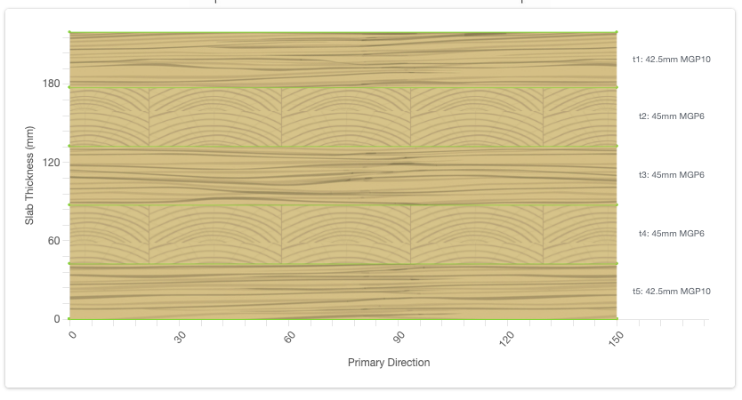

### Instructions

* Clone or fork this repository.
* Create a new branch, `assignment`, for your work.
* Invite @ikhsan017 to be a collaborator.

### Tasks

 * Cromplete the `LayupDrawer` class in `js/layup-drawer.js` to draw a layup diagram.
 * Data is provided inside `index.html` in the `cltLayup` variable.
 * Image assets are provided in the `images` directory.

### Expected Result

